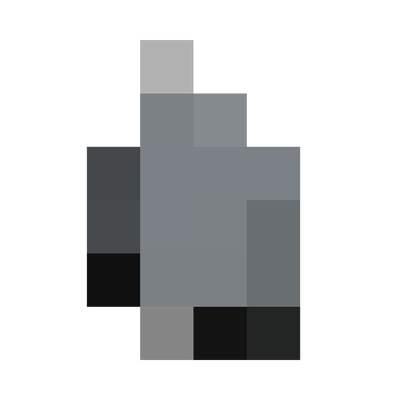

<div align="center">



[](https://blurryproject.streamlit.app/)

# Blurry Project
This is Blurry Project, upload your picture, faces will get blurred, you have an automatic and manual mode, different censorship styles, and no metadata in your final files

</div>


## Table of Contents
- [Features](#features)
- [How to Run Locally](#how-to-run-locally)
- [The Reason Behind This Project](#the-reason-behind-this-project)

## Features

- MediaPipe face recognition model
- Manual square blur mode
- original vs blurred view
- Pixelate, Blur, Black Bar styles
- Download result

## How to run locally
1. Clone this repository.
2. Install the dependencies:
```bash
    pip install -r requirements.txt
```
3. Download the face landmark model from [Google's official link](https://storage.googleapis.com/mediapipe-models/face_landmarker/face_landmarker/float16/1/face_landmarker.task) and place it in the project folder as `face_landmarker.task`.
4. Run the app:
```bash
    python -m streamlit run app.py
```
> ⚠️ If you are using very recent Python versions, you might run into compatibility issues with MediaPipe or OpenCV. Python 3.11 or 3.12 is recommended for a smoother setup.

## The Reason behind this project
This project was born from curiosity about how cameras or software detect faces. It was inspired by the "Flock" surveillance camera trend on TikTok, instead of building something to spy, why not build something to protect privacy?

## Special Thanks
Thanks to [Trulle1234](https://github.com/Trulle1234) and the [Hack Club](https://hackclub.com) [Darkroom](https://darkroom.hackclub.com) community for making this possible.

## You might also like

Check out some of my other projects:
- [BerserkMod](https://github.com/Cocotrilito/berserkmod) - A Berserk themed Minecraft mod
- [BobaBashPhotoWall](https://github.com/Cocotrilito/BobaBashPhotoWall) - A live, shared photo wall for Boba Bash events worldwide.


